# Hi, I'm singledog957 👋

I'm a master's student exploring **AI systems, computer architecture, and hardware acceleration**.

I enjoy turning research ideas into **working systems and open-source projects**.

## Open Source Contributions

<picture>
  <source media="(prefers-color-scheme: dark)" srcset="./contributions-tokyo.svg">
  
</picture>

[View all merged contributions](https://github.com/search?q=author%3Asingledog957+is%3Apr+is%3Amerged+-user%3Asingledog957&type=pullrequests)

GitHub Stats

